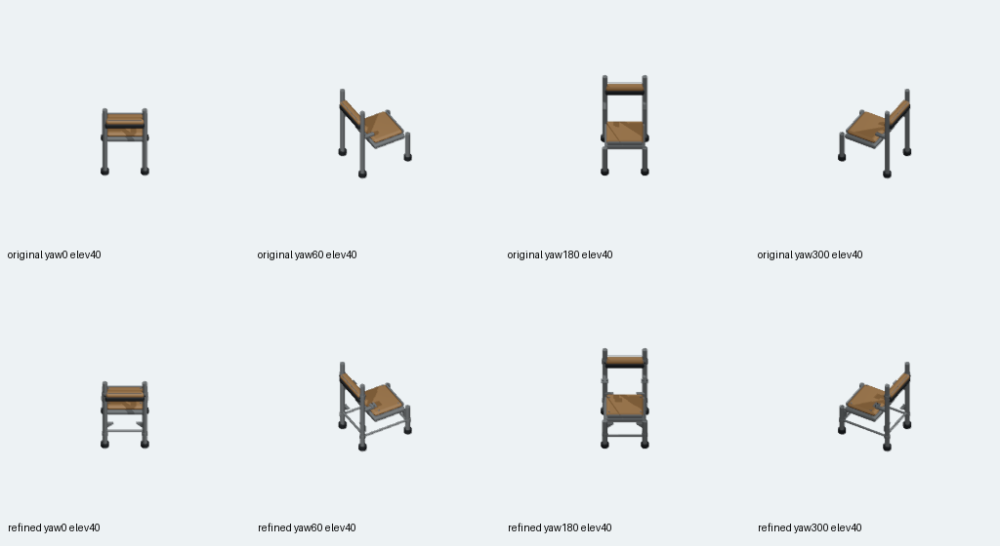
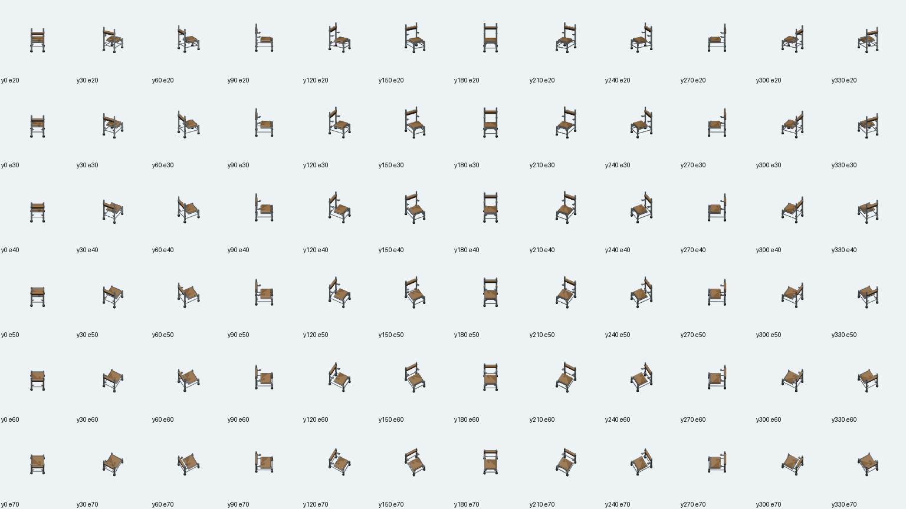

# Default wooden chair physical connections ? 2026-10-03

## First source checkpoint; offline only

Own isolated branch starts from clean57b7e46afaf1399e4b888f1920c42b641b249e6a. The approved existing `chair-wooden` / `object.chair` retains1x1, original palette, front convention and current shared64pixels-per-tile fit/target. This is actual physical modeling, not another densification batch. No browser/server/CI/schema/mapping/registry or other model changes. Canonical new-source export integration and native player proof follow this source checkpoint; no hosted completion is claimed.

Original standalone source `assets/source/blender/furniture.chair.wooden.blend` stays byte-identical, SHA256 `dab33079c7a42b2967950bab72048953270520383adbf3873a65aeb8e1b6687d`. New source `assets/source/blender/furniture.chair.wooden.angled-detail.blend` SHA256 `acd0e9decb3bb451b44e8354e797fb5656825f4748bbed832bab61659f06cd88`. Its dedicated provenance records all16 retained raw vertex/topology/material-index byte digests, actual object matrices/modifier properties, full four material graphs/node properties/color ramps/packed texture hashes, evaluated positions and original/after geometric normals. All retained raw/evaluated geometry, transforms, topology, modifier settings and material graphs match exactly. No winding reversal, recentering or scale change is performed.

## Actual modeled structure

36added meshes make52total: four side/transverse frame stretchers; four seat saddle plates and four fixing heads; four solid triangular leg gussets; two back rail retaining collars with four exposed fasteners; two back bracket mounting plates with four fixing screws; four leg stretcher collars and four joint sleeves. These are actual solid meshes inside accepted bounds. The broad original seat/back, steel frame and rubber feet remain intact; the old three-board historical chair branch is not recreated or claimed as new.

Evaluated full bounds remain exactly[-0.3859996795654297,-0.485249400138855,0] to[0.3859996795654297,0.4852507412433624,1.3200000524520874]. Loaded minimum-corner bounds remain[0.11400030553340912,0.014750592410564423,0] to[0.8859996795654297,0.9852507710456848,1.3200000524520874]. Allfour occupied rotations fit1x1. The dedicated actual-source verifier passes72camera offsets/aim vectors at256px/4tiles and existing target[.5,.5,.6600000262260437]. Shared exporter/default callbacks are untouched.

## Explicit geometric-normal boundary

Actual world-space edge cross-sums after modifiers distinguish geometric winding from weighted shading-normal attributes. Existing wooden seat bevel/clamp emits exactly12zero-area polygons, preserved from the original16-part model; their exact indices/count are recorded and the verifier rejects any additional degenerate faces. All5120nondegenerate evaluated faces of the52meshes point outward. Every new part has0degenerate faces. Initial strict source guard failed on those12original zero-area faces before any new source save; inspecting actual vertices corrected the audit definition without changing source topology or allowing general negative/degenerate surfaces. No false inward-normal defect is claimed. The original raw source remains unchanged.

## Actual paired Blender views

Four actual yaw0/60/180/300, elevation40renders use identical camera/style. The opened comparison is source/export inspection, not gameplay screenshot acceptance. Generated by pinned Blender5.2.1LTS upstream9e2066aef7ef, executable SHA256284f4041f98e113f3dc10654a7193ffaaa9bfdfec8b87fa116620a48b5f6d4cb. Repeat72, decoded margins and actual omission/material/camera/dispatch negatives with finally exact restoration are pending the next coherent export checkpoint; native worker/SaveLoad proof remains the parent's queue.

## Completed offline export checkpoint

Only the current standalone chair wrapper's source tuple and chair-only configure/camera verification dispatch changed. Its old fallback guards remain present. No shared kitchen functions, callbacks or other model tuples changed. Existing default mapping/registry/1x1 content identity and Classroom override are unchanged. The original source stays retained, and its original integrity test still checks all16 parts plus the actual new-source provenance chain.

The canonical descriptor uses the dedicated52-part source. [Actual repeat/decoded margin receipt](export-repeat-and-borders.json): every72PNG plus descriptor repeated byte-identically through both the dedicated renderer and the original production wrapper;73/73files each. Manifest SHA256 `8e3a18f1e651f998294fc6fe032a4cdc45a437fd361aac90a27d9765afa24724`, minimum independently decoded transparent margin71pixels. Replaced same-asset old frame paths were retired only after checking every current game-content JSON for references; referenced identical frames remain. Original source/history and other asset frames remain untouched.

The full72pose sheet was opened after export. [Independent fresh original/refined reopen](reopened-source-audit.json) compares every16retained raw vertex/topology/material-index fingerprint, modifier properties, matrix and evaluated position; all match exactly. All52actual convex parts have positive independently triangulated signed volume and0inward geometric faces, with only the explicit12original seat degenerates.

**19 meaningful deliberate RED controls**, followed by exact restoration:

- [Actual source producer](source-producer-controls.json): omitted physical front stretcher and reversed actual solid gusset winding, both rejected before source save. Source/provenance/builder finally restored byte-exact; production72verifyGREEN.
- [Loaded source/camera producer](producer-controls.json):12 controls for omitted stretcher, moved new mount, moved retained back, modified original bevel, original Principled graph, changed added joint material, reversed actual joint winding, wrong XYfit, target, descriptor, actual camera span and actual camera offset. All exit1 with specific semantic guard failures; byte-exact wrapper/source restoration exits0.
- [Original production dispatch](chair-dispatch-controls.json): old16-part source, wrong Yfit and wrong target independently fail actual production entrypoint; restored native72verification exits0.
- [Actual decoded PNG consumer](decoded-consumer-controls.json): an opaque corner with correct updated PNG digest/name/signature/dimensions is rejected specifically by decoded transparent-border assertion; a separate actual canonical target mutation is rejected. Exact descriptor/PNG restoration returnsunitGREEN.

Focused actual chair integrity and pipeline suites:3suites,7PASS/1SKIP (generic live Blender test skipped because Blender is not on PATH; direct pinned native Blender controls/72verifiers ran separately). No unit-only or source-preview result is presented as native player completion. Prepared TypeScript/build receipt follows separately; normal/90degree actual worker/SaveLoad and new physical support consumer proof remain the parent's serial native queue.
