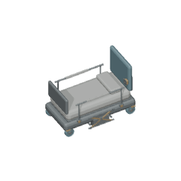
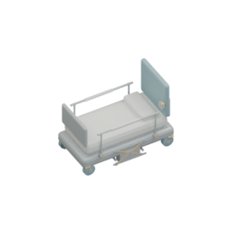

# Medical bed: actual retained Cycles source

Own isolated base `25f8dbc45138b2c14c05ee98dd71789321bc7c25`, branch `codex/infirmary-medical-bed-cycles-20261004`. This is genuine Blender source work, not game/native acceptance.

## Reopened source and connections

Blender5.2.1 LTS reopened the actual76-part `furniture.medical-bed.angled-detail.blend`, SHA256 `d18a702e585d6e69f15602d9e9f294bc0c539da3f78bf4f48fe1330da286c4fe`. Actual evaluated mesh-bound groups have sizes3/13/1/7/37/1/1/2/7/1/1/2. [Original inspection](./actual-existing-source.json) preserves all bounds/adjacency/material readings. A mesh-bound group is not a triangle-contact assertion.

Only13 physically required connections are added: mattress deck support, two lower bearing attachments, two lift cross-shaft bearing mounts, four continuous caster axles and four rail coupling sockets. Every new part joins two retained solids, with26 real triangle-interior witnesses. All76 raw meshes/topology/material assignments/modifiers/evaluated positions/normals/transforms remain exact; the new89-part assembly forms one mesh-bound group. The first shallow bearing attachment failed actual triangle containment at the beveled base; [original failure](./prepare-original.raw.txt) remains. The corrected attachment penetrates the actual base interior; no guard was relaxed.

Original four Principled shaders all used BaseRGBA(.8,.8,.8,1)/rough.5/metal0 despite explicit authored diffuse/roughness properties. The assigned dedicated-source correction transfers **only** BaseRGBA and Roughness to those exact authored properties. Four old/new input records and complete material graphs with every other input/node/link/property unchanged are retained in [the actual reopened source receipt](./actual-before-after.json). This is the requested existing-material pipeline repair, not new palette approval. Original source and source72/body mappings remain immutable at this checkpoint.

## Saved source and genuine two-pose samples

Saved `assets/source/blender/furniture.medical-bed.soft-light.blend`, SHA256 `786abf1ae0e37b99ddb507618918f04472560a68f78bcd22a7f3b5097c822c2c`. Footprint1x2, min-corner(.5,1,0), target(.5,1,.675000011920929),256RGBA/ortho4/64pixels-per-tile remain. Original evaluated bounds are unchanged. New dedicated scene uses the existing three broad soft lights read-only, CPU/thread1/128samples/seed0/noadaptive/AgXNone/OpenImageDenoiseCPU, no ground geometry. Shared profile/light/palette files stay unchanged.

Original76 Workbench60/300e40 samples are byte-exact against their published frames. Connected89 Workbench and soft89 samples share geometry. Soft comparisons were rerendered from the **actual saved .blend** with retained geometry/graph/contact/profile validation, [raw saved-source run](./saved-comparison.raw.txt). These are source renders, not UI screenshots.

Reproduce with pinned Blender `--background --factory-startup --threads 1 --python-exit-code 1 --python tooling/blender/prepare-medical-bed-cycles.py`; use `-- --refresh-saved-comparison` to reopen and revalidate the saved source without resaving it. At the first published checkpoint only source/samples were complete. The bounded continuation is recorded below. Root owns genuine game build/browser/native and any native helper changes.

## Complete actual72 and real omission controls

The saved source generated72 genuine CPU1 poses in215.31965970003512 seconds; every actual PNG/body/path/transparent-border is decoded and checked. Four30/120/210/300e40 independent rerenders match bytes exactly. [Actual matrix](./actual-matrix.json), [four repeats](./actual-four-repeats.json), [raw full run](./full72.raw.txt), [raw repeats](./four-repeats.raw.txt). Original Workbench72 images, immutable source and the full [archived descriptor](../../../assets/source/blender/furniture.medical-bed.workbench-descriptor.v1.json) remain.

Current canonical LF descriptor SHA256 `293bfa9389e3dd04eb704d39bcdc78e97ef3693cb1910f9ab8fa0601d24fe757`.
Source60/e40 `/assets/environment/oblique/furniture.medical-bed.variants-yaw+60-elev40.a2c875cba534.png`, SHA256 `a2c875cba5348fa4bfcc76947f0dbf3e335a7a93aaf8de5731700df8fc28f7aa`.
Source300/e40 `/assets/environment/oblique/furniture.medical-bed.variants-yaw+300-elev40.d7b0bb53fa1f.png`, SHA256 `d7b0bb53fa1fbcad780009f57cde8396327d5e5dcb44ecf6709bd72727c360e9`.

Real saved caster-axle disconnection fails actual triangle-contact validation before hashes; actual dedicated configure omission runs the original76-mesh loader against89 and fails. Restoring original Workbench descriptor and removing the live registry entry each fail both actual typed q0/q1 projection consumers. All four mutations restoreGREEN individually, with1044 protected source/body/renderer/UI/browser files byte-exact. [Actual production controls](./actual-production-controls.json), [terminal raw](./actual-production-controls.raw.txt). Reproduce with `python tooling/verify-medical-bed-cycles-production.py`.

The new q0/q1 consumer first fails2RED on the actual old live descriptor [original output](./original-current-consumer.raw.txt); after actual72 export it passes2GREEN. The historical76-part unit then fails1RED/2GREEN because the live source changed [original historical output](./original-historical-consumer-red.raw.txt). It now uses the exact archived descriptor while preserving every old topology/material/normal/decoded72/mapping assertion. Current focused8GREEN/4files and strict app/tools types exit0: [focused](./final-focused.raw.txt), [types](./strict-types.raw.txt).

Actual Infirmary plan at(4,4), sequence2, retains6x6 shell/4x4 room and its original medical-bed/cabinet contents. Bed literalowner `room-template-000000000002-2-object-000`: q0 anchor(5,5)/orientation0 with whole1x2 projection; q1(7,5)/orientation1 with whole2x1 projection. The existing context registry resolves the new actual source60 frame with unchanged input room/structure data. This is typed plan/projector consumption, **not** completed paid public construction or whole V10 native Save/Load. No game build/browser/native ran here; native material/pixel validation remains root-owned.
