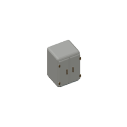
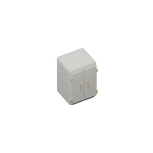

# Medicine cabinet: retained modern source preparation

Base `bd6351f7f982381ee79f181d2567f65d1004d91e`; own isolated branch `codex/infirmary-medicine-cabinet-cycles-20261004`.

## Actual source inspection and narrow correction

Genuine Blender5.2.1 LTS reopened original66-part cabinet source `fixture.medicine-cabinet.angled-detail.blend` (f03b6fc2d33d83c069b181073616ae95031839e130d890b9f5374cfd947be5ea). Evaluated mesh-bound connectivity found one59-part component, four isolated hinge pin heads and a detached3-part lower service plate/fasteners. [Actual original inspection](./actual-existing-source.json) preserves every evaluated bound, adjacency and shader reading. Mesh-bound grouping is not a triangle-contact claim.

The new dedicated source adds only four continuous brass hinge shafts and one hidden backing support. Original66 raw topology/vertices/material assignments/modifiers/evaluated positions/transforms/normals remain exact. Every new shaft penetrates its three retained knuckles and head; backing support joins retained body and plate.18 real triangle-interior witnesses and one71-part mesh-bound group are recorded in the reopened source provenance. The first proposed shallow backing did not enter the body's beveled bottom face; its original real contact RED is retained in [the raw output](./original-backing-contact-red.raw.txt). The deeper hidden support passes actual triangle containment; no assertion was relaxed.

The original three Principled graphs have gray(.8,.8,.8,1)/rough.5/metal0 inputs, unlike their authored viewport paint/roughness properties. Root assigned a dedicated-source pipeline correction under the owner's requested real modern models: transfer **only** each existing exact diffuseRGBA to Base Color and existing roughness property to Roughness. Preserve Principled Metallic0 and every other socket/node/link/property. This is an implementation decision, not a new owner palette approval. All three actual input diffs and full legacy/new graphs are preserved; approved paint values are not invented.

Saved source `assets/source/blender/fixture.medicine-cabinet.soft-light.blend`, SHA256 `1bb3821056d58d39dc51de6788689ad780e3bed59c20a5f3625714f2480e9732`. Occupied1x1, original min-corner(.5,.5,0), target(.5,.5,.5899999737739563),256RGBA/ortho4/64pixels-per-tile remain. The new source uses three existing broad soft emitters read-only from the current comparison profile, dedicated128 samples/CPU/thread1/seed0/noadaptive/AgXNone/OpenImageDenoise CPU, no floor geometry. Shared profile/light/palette files are unchanged.

## Genuine comparisons

Original66 Workbench60/300e40 photos match published bytes. Connected71 Workbench and soft authored-material71 photos show the same geometry at those two poses; the latter were rerendered from the **actual saved .blend**, not an in-memory mock. These are source images, not screenshots or native acceptance. Bothposes show the cabinet rear/side; the full matrix must cover the front too.

Full72 export, four independent exact repeats and producer mutation/restoration controls are now complete below. Runtime mapping/native/browser/build belongs to root; no such execution ran here.
## Complete actual export and source controls

72 actual Blender5.2.1 CPU1 poses were rendered in170.9421932999976 seconds, with complete decodedRGBA/CRC/transparent-border and body/path hashes verified. Original72 Workbench PNGs and immutable source remain; [their whole archived descriptor](../../../assets/source/blender/fixture.medicine-cabinet.workbench-descriptor.v1.json) keeps old literal pins. Four30/120/210/300e40 real independent rerenders are byte-exact; [receipt](./actual-four-repeats.json). The current LF descriptor SHA256 is `f301d4def0086c6eae4c7ba8c34de972a1844a0b684a1761855659683fdeab0d`.

Current source60/e40 body: `/assets/environment/oblique/fixture.medicine-cabinet.variants-yaw+60-elev40.bdd5f5183c55.png`, SHA256 `bdd5f5183c55984e20fe289701dadfb7ff9e350c06e4919e339c85bcb4d8a0bd`.
Current source300/e40 body: `/assets/environment/oblique/fixture.medicine-cabinet.variants-yaw+300-elev40.511adeeed0f9.png`, SHA256 `511adeeed0f9051373ae1adc48c9bf424ad5424d41a4512c041e2d5525adc711`.

The additional source150/e40 pair below genuinely reopens the same saved71-part model, toggles only Workbench/Cycles presentation, and matches the published current full72 body. It exposes original handles/hinges/door seams, whereas60/300 show rear/side. [Actual front receipt](./actual-front-source-comparison.json); [exact inert reproduction source](./front-source-comparison.py.txt) can be copied to an ownTEMP .py and executed with the pinned Blender CLI from this repository. No binary model is resaved in that comparison.

Actual saved shaft disconnection yields contactRED before byte/hash guards. Omitting the dedicated producer's actual configure installation yieldsRED through the real selected exporter callback. Replacing the live descriptor with original Workbench bytes and removing its registry entry each makes the actual typed q0/q1 consumerRED. Every mutation is individually restoredGREEN. All1044 protected source/descriptor/old+new bodies/renderer/UI/browser fixture files match byte-exact before/after dictionaries. [Production control receipt](./actual-production-controls.json), [summary raw](./actual-production-controls.raw.txt). No browser/build/native was run.

The original old-source unit fails1R/2G after switching the live descriptor. Its historical assertions now consume the preserved immutable archived descriptor, with the same original66 parts/three graphs/72 decoded PNG/source/mapping/footprint guards. New current source-production and q0/q1 projection consumers cover the live saved71 source. Final focused source groups31GREEN/5files; strict app/tools types exit0. [OriginalR](./original-current-consumer-red.raw.txt), [final focused](./final-focused.raw.txt), [types](./strict-types.raw.txt).

Actual current Infirmary plan at(4,4), sequence2, has unchanged6x6/4x4 room with medical-bed and medicine-cabinet contents. Cabinet literalowner `room-template-000000000002-2-object-001`: q0 anchor(7,5)/orientation0; q1(8,7)/orientation1. Current projected whole1x1 solid resolves existing assetID/registry and literal source60e40 body; input room/structure data stay unchanged. This is typed plan/render consumption, **not** completed paid public construction or whole V10 native Save/Load.

Reproduce with pinned `blender --background --factory-startup --threads1 --python-exit-code1` (separate CLI arguments `--threads 1`, `--python-exit-code 1`): preparation then `--refresh-saved-comparison`, dedicated renderer, renderer `--repeat-four`, and `python tooling/verify-medicine-cabinet-cycles-production.py`. Registry/object mapping already selects the unchanged existing assetID.

## Canonical and shared Infirmary producer boundary

The real canonical entry is `tooling/blender/render-medicine-cabinet-detail-oblique.py`; there is no `render-medicine-cabinet-oblique.py`. Its original executable route and shared `render-medical-oblique.py` still selected the old Workbench66 source, which could regenerate the live modern descriptor incorrectly. Root assigned the narrow Medicine-only dispatch correction before handoff: canonical execution now delegates to the saved Cycles producer, while imported legacy audit functions remain available to preparation. Shared Infirmary changes only the Medicine source tuple and an early Medicine configure callback. Medical bed tuple/remaining path, shared Kitchen, lights and profile are untouched; saved min-corner geometry is not translated a second time.

The real canonical entry was executed via runpy with `--verify`, then independently checked for actual opened saved-source path, Cycles128/denoising and71 meshes. Omitting its actual early dispatch executes the original66 Workbench path and fails this same check. Omitting the actual shared Infirmary callback loads71 through the old66 audit and fails its mesh-set guard. Exact restoration returns bothGREEN; shared actual callback also verifies72 camera transforms, original bed tuple, target and64-pixel pitch. Canonical `--verify-exports` decodes the published72 without additional rendering. [Actual continuation receipt](./actual-canonical-entry-controls.json), [original canonical omission](./actual-canonical-entry-omission-RED.raw.txt), [original shared omission](./actual-shared-Infirmary-omission-RED.raw.txt), [terminal output](./canonical-controls.raw.txt). All1046 protected files are byte-exact before/after. This continuation does not modify the earlier four-control receipt.

Current bounded source/historical/current-consumer groups9GREEN/5files, strict app/tools types exit0 and documentation/type-coverage contracts32GREEN/5files. [Current focused output](./canonical-focused.raw.txt), [current types](./canonical-types.raw.txt), [current documentation contracts](./canonical-doccontracts.raw.txt). The inherited citation failure was resolved by fetching its already-published branch; no citation exemption changed. Earlier31GREEN receipt remains historical; neither count is a game/native result. Run `python tooling/verify-medicine-cabinet-cycles-production.py --canonical-entry-controls` to repeat only this bounded real dispatch control.

Runtime still needs genuine game build/public Infirmary q0/q1 ownership/cost/current HTTP/Blob and whole V10 Save/Load/material observation. Existing native fixture and original pixel floors were untouched; their relevance to shader gradients is unmeasured here.
