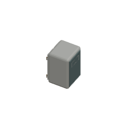
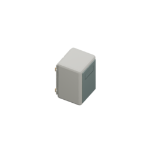

# Medicine cabinet: retained modern source preparation

Base `bd6351f7f982381ee79f181d2567f65d1004d91e`; own isolated branch `codex/infirmary-medicine-cabinet-cycles-20261004`.

## Actual source inspection and narrow correction

Genuine Blender5.2.1 LTS reopened original66-part cabinet source `fixture.medicine-cabinet.angled-detail.blend` (f03b6fc2d33d83c069b181073616ae95031839e130d890b9f5374cfd947be5ea). Evaluated mesh-bound connectivity found one59-part component, four isolated hinge pin heads and a detached3-part lower service plate/fasteners. [Actual original inspection](./actual-existing-source.json) preserves every evaluated bound, adjacency and shader reading. Mesh-bound grouping is not a triangle-contact claim.

The new dedicated source adds only four continuous brass hinge shafts and one hidden backing support. Original66 raw topology/vertices/material assignments/modifiers/evaluated positions/transforms/normals remain exact. Every new shaft penetrates its three retained knuckles and head; backing support joins retained body and plate.18 real triangle-interior witnesses and one71-part mesh-bound group are recorded in the reopened source provenance. The first proposed shallow backing did not enter the body's beveled bottom face; its original real contact RED is retained in [the raw output](./original-backing-contact-red.raw.txt). The deeper hidden support passes actual triangle containment; no assertion was relaxed.

The original three Principled graphs have gray(.8,.8,.8,1)/rough.5/metal0 inputs, unlike their authored viewport paint/roughness properties. Root assigned a dedicated-source pipeline correction under the owner's requested real modern models: transfer **only** each existing exact diffuseRGBA to Base Color and existing roughness property to Roughness. Preserve Principled Metallic0 and every other socket/node/link/property. This is an implementation decision, not a new owner palette approval. All three actual input diffs and full legacy/new graphs are preserved; approved paint values are not invented.

Saved source `assets/source/blender/fixture.medicine-cabinet.soft-light.blend`, SHA256 `1bb3821056d58d39dc51de6788689ad780e3bed59c20a5f3625714f2480e9732`. Occupied1x1, original min-corner(.5,.5,0), target(.5,.5,.5899999737739563),256RGBA/ortho4/64pixels-per-tile remain. The new source uses three existing broad soft emitters read-only from the current comparison profile, dedicated128 samples/CPU/thread1/seed0/noadaptive/AgXNone/OpenImageDenoise CPU, no floor geometry. Shared profile/light/palette files are unchanged.

## Genuine comparisons

Original66 Workbench60/300e40 photos match published bytes. Connected71 Workbench and soft authored-material71 photos show the same geometry at those two poses; the latter were rerendered from the **actual saved .blend**, not an in-memory mock. These are source images, not screenshots or native acceptance. Bothposes show the cabinet rear/side; the full matrix must cover the front too.

Full72 export, four independent exact repeats and producer mutation/restoration controls are pending in the next coherent chunk. Runtime mapping/native/browser/build belongs to root; no such execution ran here.